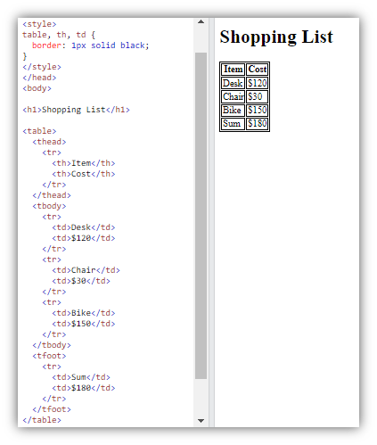

# Read: 07 - HTML Tables; JS Constructor Functions

## Data Modeling

Domain modeling is the visual process of communicating business requirements. Understanding the data model of code helps you identify solutions to the problem domain of a feature or project. Good planning in software engineering makes use of a design phase in which domain modeling is conducted. In this phase data modeling is conducted throu the design of a simplified diagram ofthat gives general information about data elements required and how it need to flow to solve a problem.

 

## Tables
HTML has an table element (```<table>```) in wwhich data can be presesnted on the webpage in table format. The table element must contain rows (```<tr>```) and data (```<td>```). The table element can almost mhold table header (```<thead>```) and footer (```<tfoot>```) as well. Table element are useful when you want to present a more organized view to the page visitor. Here is a simple illustration of what a table element may look like in HTML:

 

## Functions, Methods, and Objects

Object Constructors are an alternative method to object literals in that is allow you to define a constructor function you can re-use to create multiple objects. To use an object constructor, you must "new" keyword and supply the values you wish to use in your new object. To access data stored in an object, you can use dot notation. Using the constructor is a quicker way to create an object since you only need to pass in values you want to be used in the constructor. Here's a visual example of how constructor notations work to define an object.


