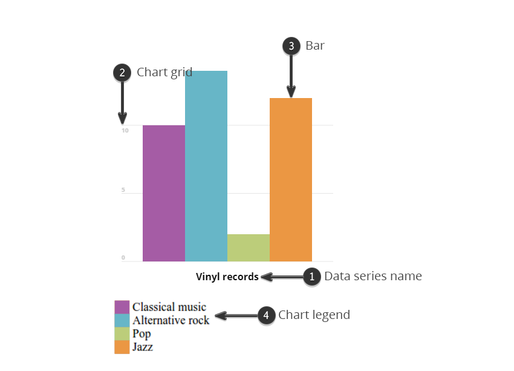

# Read: 12 - Docs for the HTML <canvas> Element & Chart.js

## The Canvas Element
Like the ‘’’’’’ element, you can set height and width or the ‘’’<canvas>’’’. If these attributes are not set, the default values will be 300 pixels wide and 150 pixels high. Unless styling rules are applied, the canvas element will be transparent and empty.

## What can you do with the canvas element?
You can use the canvas element to draw shapes and texts. While the shape is drawn on the canvas,  the actual drawing is done through JavaScript. There are various methods for drawing paths, boxes, circles, text, and adding images.  
Chart.js, is a JavaScript plugin that uses the HTML5 canvas element to draw the graph charts such as bar charts, line charts, pie charts  onto the page. Charts are useful when you want to show important relationships or patterns between data points. If you use create a chart using the canvas element, consider the information you will need to generate a chart. Here is a visual represention, compliments of Negoita (2017).

References:
Negoita, J. (May, 2017). How to Draw Bar Charts Using JavaScript and HTML5 Canvas. Retrieved from: https://code.tutsplus.com/tutorials/how-to-draw-bar-charts-using-javascript-and-html5-canvas--cms-28561

